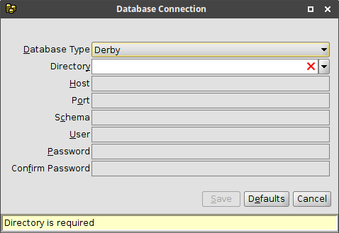
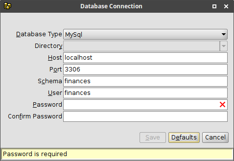

# Configuration

The application creates the following configuration files in a directory named
`.finances` in your home directory.

| File Name | Description |
|---|---|
| connection.conf | database connection settings |
| finances.properties | GUI settings |
{:.definitions}

## Connection settings

The first time you run the application you must complete a dialog to
provide the database connection settings.  The values provided in this
dialog will be stored in the `connection.conf` file and and used on
subsequent runs of the application.  This file contains the password
used by the application to connect to the database so the file should
not be accessible to other users.  When the application creates this file,
it attempts to set the permissions so that the file is only accessible by you
but if that fails, you should set the permissions manually.

The required connection parameters depend on the type of database
being used.  Clicking on the <button>D<u>e</u>faults</button> button will
populate the fields with default values for the selected database type.

When using *Derby*, you only need to specify the directory that will be
used to store the database files.  The default is to use a directory under
`.finances` in your home directory.

When using *MySql* or *PostgreSQL*, you need to provide the following
parameters.

| Parameter | Description |
|---|---|
| Host | the IP address or hostname of the machine where the database is installed |
| Port | the port on which the database service is listening |
| Schema | the name of the database schema where the application tables will be stored |
| User | the database user ID for the application |
| Password | the database password for the application |
{:.definitions}

If the database schema and/or user do not already exist then the application
will attempt to create them.  If the database user does not exist or
does not have the permissions required to create the the schema then you
will be prompted to provide another database account that will be used to
create the application user and/or schema.  The second database account is
only used during the initialization process and is not stored in the
configuration files.

## GUI settings

The application includes several windows that display information in
a table.  The columns in each of these tables can be resized and reordered.
When you exit the application, the current window sizes and the layout of
each table is stored in the `finances.properties` file so that they can
be restored the next time the application is run.