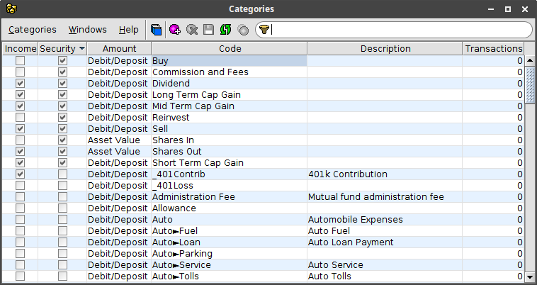

# Overview
Finances is an application for tracking personal finances using a SQL database.

It requires a [Java 8](https://java.com/en/download/) compatible runtime environment.

## Database support
The application data is stored in a SQL database.  The supported databases are
[MySql](https://dev.mysql.com/downloads/mysql/), [PostgreSQL](https://www.postgresql.org/download/)
and [Derby](https://db.apache.org/derby/).

When using *MySql* or *PostgreSQL*, the database runs as a separate application
and must be installed separately.  The main advantage of using *MySql* or *PostgreSQL*
is that multiple instances of the **Finances** application can access the data concurrently.

When using *Derby*, the database runs as part of the **Finances** application
and does not require a separate installation.  However, only one instance of the
**Finances** application can access the data at any given time.

## Data model
All transactions are associated with at least one account.  Transfers are
associated with multiple accounts.  The following types of account are supported:
`Bank`, `Brokerage`, `Cash`, `Credit`, `Loan` and `401k`.  Transactions involving
securities (stocks, bonds, etc.) are supported in `Brokerage` and `401k` accounts.
Each transaction can be associated with a *Payee* to indicate the other party
involved in the transaction.  Each transaction can also be assigned a reference
number (e.g. a check number).

Each transaction includes one or more line items.  Each line item specifies
an income, expense or transfer amount.  An income or expense line item can
be assigned a category.  A transfer line item must indicate the other account
involved in the transfer.  For security transactions, some line items also
require a security amount (shares).  When a security is sold, the specific shares
for the sale can also be selected from prior purchase transactions.

## Application windows
The application includes the following windows for viewing and editing the data.

{:.icon} **Accounts**
Displays all of the accounts and their properties.

{:.icon} **Categories**
Displays all of the transaction categories and their properties.

{:.icon} **Groups**
Displays all of the transaction groups and their properties.

{:.icon} **Payees**
Displays all of the payees and their properties.

{:.icon} **Securities**
Displays all of the securities and the total shares across all accounts.

{:.icon} **Account Securities**
Displays the currently held securities and the shares per account.

{:.icon} **Transactions**
Displays transactions for an account.  Multiple transactions windows can be open at the same time.