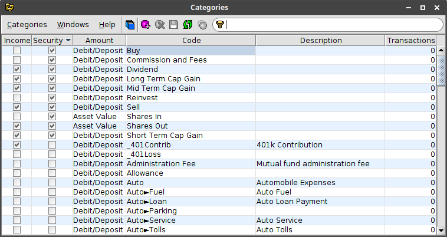

#  Transaction Categories

Each line item in a transaction can be assigned a category.  Categories can
also be divided into sub-categories.  Sub-categories are displayed with the
format <code class="highlighter-rouge"><em>parent</em>&#9658;<em>sub-category</em></code>.
Each category is identified by a unique code which includes the parent category's code.
Renaming a parent category will automatically update the codes of its sub-categories.
The **Categories** window displays all of the categories and can be used to add,
delete or modify categories.  The window also shows the number of usages of each category.
The **Categories** window can be accessed from a **Transactions** window by clicking
on the {:.button} button in the toolbar.

## Reserved categories
The following predefined categories are used to track security lots and can not
be modified.

| Code | Description |
|---|---|
| Buy | purchase of a security |
| Commission and Fees | fees associated with buying/selling a security |
| Dividend | dividend payment for a security |
| Reinvest | purchase of a security using dividends |
| Sell | sale of a security |
| Shares In | transfer of a security into an account |
| Shares Out | transfer of a security out of an account |
{:.definitions}

## Category properties
Each category has the following properties.

| Property | Description |
|---|---|
| Income | indicates whether the category is used for income |
| Security | indicates whether the category is used for security transactions |
| Amount | `Debit/Deposit` the amount affects the account balance. `Asset Value` the amount represents the value of the security involved in the transaction |
| Code | unique name of the category |
| Description | description of the category |
{:.definitions}

## Window Toolbar
The following actions are available on the **Categories** window toolbar.

{:.button} New Category
: Add a new category.

{:.button} Delete
: Delete the selected categories.  Only enabled for unused categories (no transactions and no sub-categories).

{:.button} Save
: Save changes to the categories.

{:.button} Reload Categories
: Reload the categories, discarding any unsaved changes.

{:.button} Merge Categories...
: Merge the selected categories.  You will be prompted to select the destination category.
