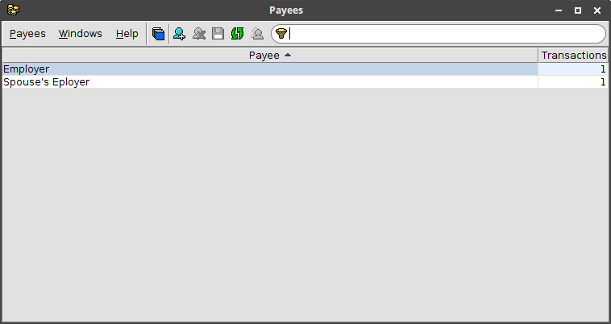

#  Payees

Every transaction can be associated with a payee.  Each payee is identified
by a unique name.  The **Payees** window displays all of the payees and can
be used to add, delete or rename payees.  The window also shows the number of
transactions for each payee.  The **Payees** window can be accessed from a
**Transactions** window by clicking on the
{:.button}
button in the toolbar.

## Payee properties
Each Payee has the following properties.

| Property | Description |
|---|---|
| Name | unique name of the payeee |
{:.definitions}

## Window toolbar
The following actions are available on the **Payees** window toolbar.

{:.button} New Payee
: Add a new payee.

{:.button} Delete
: Delete the selected payee.  Only enabled for an unused payee (no transactions).

{:.button} Save
: Save changes to the payees.

{:.button} Reload Payees
: Reload the payees, discarding any unsaved changes.

{:.button} Merge Payees...
: Merge the selected payees.  You will be prompted to select the destination payee.
