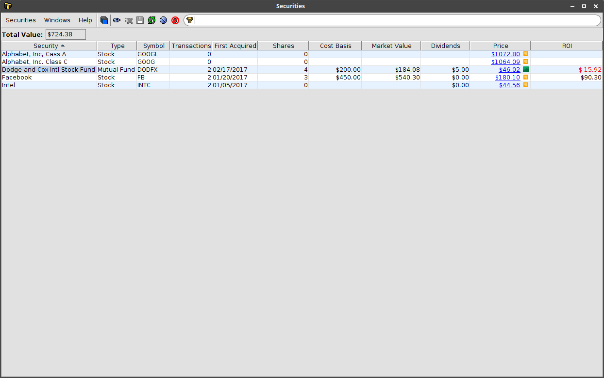

#  Securities


Transactions in `Brokerage` and `401k` accounts can be associated with a
security (stock, bond, mutual fund, etc.).  Each security is identified
by a unique name.  The **Securities** window can be used to add, delete
or modify securities.  The window also shows the number of transactions
and the total shares currently held for each security.  If quote providers
are configured then the price and market value of the shares is also displayed.
The  **Securities** window can be accessed from a **Transactions** window
by clicking on the {:.button}
button in the toolbar.


While the **Securities** window displays totals for securities across all
accounts, the **Securities by Account** window displays the securities held
in each account.  The **Securities by Account** window is read-only.  If
quote providers are configured then this window will also display price,
market value and return on investment.  The **Securities by Account** window
can be accessed from a **Transactions** window by clicking on the
{:.button}
button in the toolbar.

## Security properties
The following properties are displayed for each security in the **Securities**
and **Securities by Account** windows.

| Property | Description |
|---|---|
| Name | unique name of the security |
| Type | the type of the security |
| Symbol | the symbol used to lookup price quotes |
| Transactions | the number of transactions for the security |
| First Acquired | the date the security was first acquired |
| Shares | the total number of shares currently held |
| Cost Basis | the purchase cost of the currently held shares |
| Dividends | the total dividends received for the security |
| Price | the most recent quote for the security (requires a quote provider) |
| Market Value | the market value of the currently held shares (requires a quote provider) |
| ROI | return on investment for the security (market value - cost basis) (requires a quote provider) |
{:.definitions}

## Window toolbar
The following actions are available on the **Securities** window toolbar.

{:.button} New Security
: Add a new security.

{:.button} Delete
: Delete the selected security.  Only enabled for an unused security (no transactions).

{:.button} Save
: Save changes to the securities.

{:.button} Reload Securities
: Reload the securities, discarding any unsaved changes.

{:.button} Edit Splits...
: Edit splits for the selected security.

{:.button} Hide Zero Shares
: Hide securities with zero shares.

## Quote providers
To enable displaying security quotes, market value and return on investment,
one or more of the following providers must be configured.  Security quotes are
loaded in the background and *Pending...* will display in the **Price** column
until the quote is available.  If none of the providers returns a quote for a
security then *Not Available* will be displayed in the **Price** column.

### IEX Trading
[IEX Trading](https://iextrading.com/) provides a
[free stock quote API](https://iextrading.com/developer/) that can be enabled by adding
the following configuration to a file named `finances.conf` in the `.finances`
directory under your home directory.  This API supports getting multiple stock
quotes with a single request and provides the fastest load time for quotes.
```hocon
finances {
  stockquote {
    iextrading.enabled = true
  }
}
```

### HTML Scraper
One or more scrapers can be configured to extract stock quotes from web pages using
a CSS selector.  The following parameters are used to configure an HTML scraper.

| Parameter | Description |
|---|---|
| urlFormat | quote request URL format using *${symbol}* as a placeholder for the security symbol |
| iconUrl | URL of the provider icon to display in the **Price** column (optional) |
| price.selector.query | CSS query to select the HTML element containing the quote |
| price.selector.attribute | name of the HTML attribute containing the price.  If not specified then the HTML tag content is used. |
{:.definitions}

Below is a sample configuration that gets quotes from IEX Trading and then
uses Google Finances for any missing prices.

```hocon
finances {
  stockquote {
    iextrading.enabled = true
    scrapers = [{
      urlFormat = "https://finance.google.com/finance?q=${symbol}"
      iconUrl = "https://finance.google.com/finance/favicon.ico"
      price {
        selector = {
          query = "#sharebox-data > meta[itemprop=price]"
          attribute = "content"
        }
      }
    }]
  }
}
```
