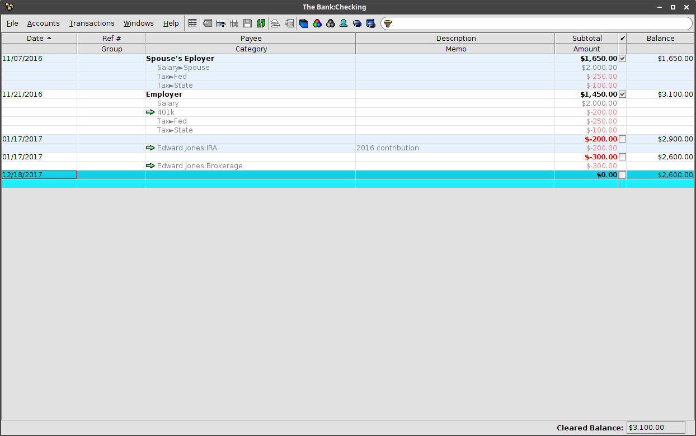
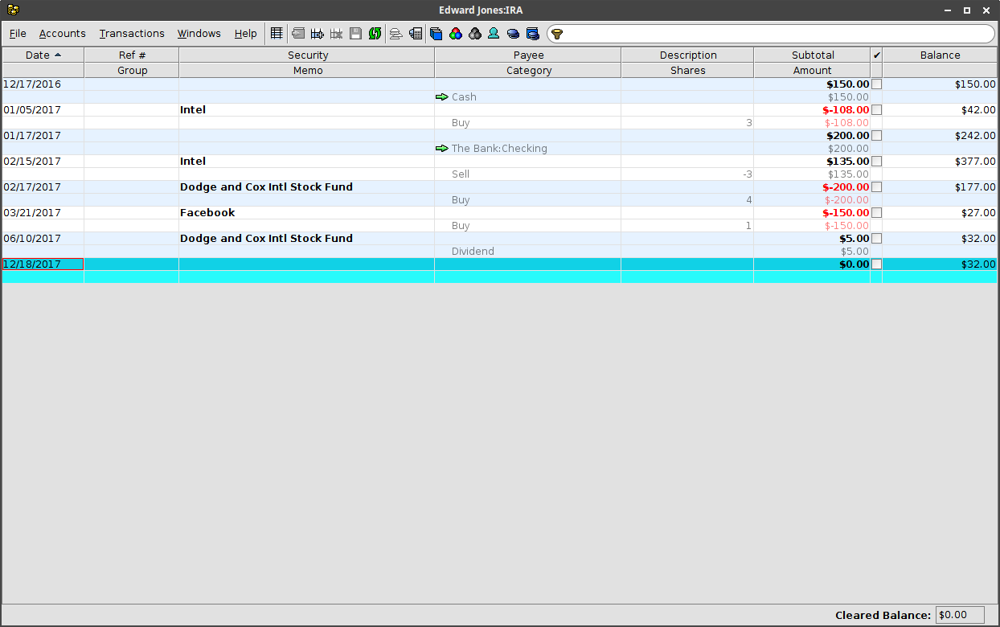
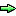
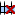
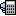

#  Transactions

Each transaction window displays the transactions for an account.  The selected
account for a window can be changed using the **Accounts** menu.  Multiple
transaction windows can be open at the same time, allowing multiple accounts to be
viewed simultaneously.

Each transaction is displayed with a single summary line followed by one or
more detail lines.  A blank transaction is included at the bottom of the table
to allow entering new transactions.  Additional details can be added to a
transaction using the {:.button} button or typing `ctrl-Enter`
on the keyboard.  For the empty transaction at the bottom of the table, typing
`Tab` in the last editable cell of the last detail will also add another detail row.
Changes to the currently selected transaction can be saved by typing `Enter`.
The **Save** action on the window toolbar can be used to save changes for all of the
transactions in the window.

Transactions can be reconciled with an account statement using the **&#10004;** (Cleared)
column.  Selecting or unselecting the checkbox for a transaction will update the
**Cleared Balance** at the bottom of the window which can be verified against
the ending balance for the statement.

## Transaction properties
The following properties are displayed for each transaction in the **Transactions** windows.

| Property | Description |
|---|---|
| Date | the date of the transaction |
| Ref # | a reference number associated with the transaction (for example, a check number) |
| Security | the security associated with the transaction (only displayed for security accounts) |
| Payee | the payee for the transaction |
| Description | a description of the transaction |
| Subtotal | the total of the transaction detail amounts |
| &#10004; (Cleared) | a checkbox indicating whether the transaction has been reconciled |
| Balance | the resulting account balance after the transaction |
{:.definitions}

## Transaction details
The following properties are displayed for each transaction detail in the **Transactions** windows.

| Property | Description |
|---|---|
| Group | the transaction group for detail |
| Category | the transaction category or transfer account ({:.icon}) for the detail |
| Memo | a description of the detail |
| Shares | the security shares for the detail (only displayed for security accounts) |
| Amount | the amount for the detail |

## Window toolbar
The following actions are available on the **Securities** window toolbar.

{:.button} New Window...
: Open a new transactions widow.

{:.button} Move...
: Move the current transaction to a different account.

{:.button} Insert Detail
: Add a new detail row to the current transaction.

{:.button} Delete Detail(s)
: Mark the selected rows for deletion.  The rows will be deleted when changes are saved.

{:.button} Save
: Save changes to the transactions.

{:.button} Reload Transactions
: Reload the transactions, discarding any unsaved changes.

{:.button} Edit Lots...
: Edit the lot selection for a security sale.  Only enabled for a security sale detail.

{:.button} Update Shares...
: Update the securities held in a 401K.  Only enabled for a 401K account.

{:.button} Organize Accounts...
: Displays the [Accounts]({{ "/windows/accounts" | relative_url }}) window.

{:.button} Categories...
: Displays the [Transaction Categories]({{ "/windows/categories" | relative_url }}) window.

{:.button} Groups...
: Displays the [Transaction Groups]({{ "/windows/groups" | relative_url }}) window.

{:.button} Payees...
: Displays the [Payees]({{ "/windows/payees" | relative_url }}) window.

{:.button} Securities...
: Displays the [Securities]({{ "/windows/securities" | relative_url }}) window.

{:.button} Securities by Account...
: Displays the [Securities by Account]({{ "/windows/securities" | relative_url }}) window.
